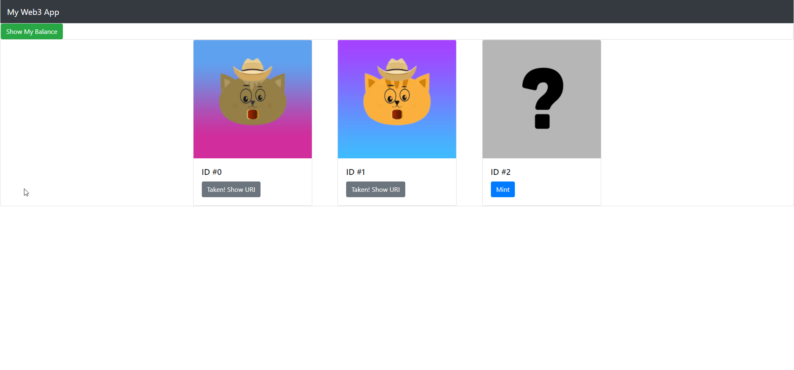
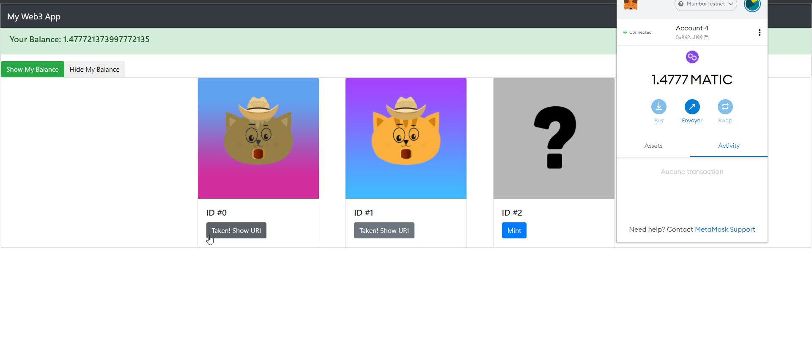

# NFT WebApp
Web3 refers to decentralized webapps that use blockchains.  
In this project I have built a smart contact from scratch and interacted with it on the web using Ethers.js and Angular.  
On the the WebApp the user can mint NFTs with a wallet like MetaMask.  
There are various technologies involved, but the main idea is to access the API of a smart contract from a frontend web app using Angular.   
     

